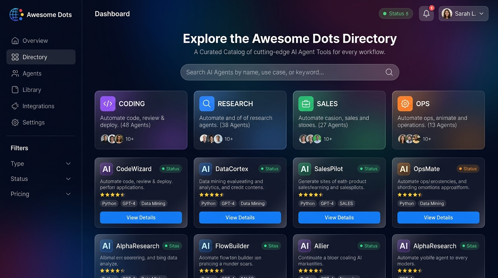

<h1 align="center">Awesome Dots: A curated collection of architectures, tools, policies, and workflows for the OpenAI Dots ecosystem.</h1>

  
  
  
  
  
  

## Overview:

- A curated collection of architectures, tools, policies, workflows, and resources for the OpenAI Dots ecosystem.
- Covers operational tracks, field deployments, integrations, governance policies, developer tools, and multi-agent systems.
- **Use case:** A practical reference for discovering, evaluating, and implementing Dots-based workflows and integrations.

## Project Showcase

| Dimension | Count / Scope | Details |
| :--- | :--- | :--- |
| **Operational Tracks** | 8 Functional Categories | Engineering, Inbox, Research, Sales, Finance, Content, Admin, Teams |
| **MCP Connectors** | 150 Standardized Connectors | Developer Tools, Collaboration, Finance, CRM, Cloud, AI, and IoT |
| **Dot Skills** | 160 Ready-to-Use Skills | Standing prompts across Engineering, Research, Ops, Sales, Writing |
| **Curated Catalog** | 350+ Verified Resources | Official docs, field cases, connectors, tools, alternatives |
| **Governance Policies** | 2 Ready-to-Use Sets | Baseline 5-rule safety pack and operational domain rules |
| **Bridges & Tunnels** | 12+ Bridge Protocols | MCP servers, desktop client tunnels, Slack, Teams, Discord |
| **Integration Blueprints** | Standardized Schemas | Permission boundaries, OAuth authentication, revocation paths |

## Website Showcase:

  

  Explore the upcoming interactive web catalog with real-time filtering, search, and detailed inspection cards.

## Quick Links

  <b>
    <a href="docs/compatibility.md">Architecture Guide</a> &nbsp;|&nbsp;
    <a href="docs/skills/README.md">Skills Library (160)</a> &nbsp;|&nbsp;
    <a href="docs/connectors/README.md">MCP Connectors (150)</a> &nbsp;|&nbsp;
    <a href="docs/starter-policy.md">Safety Policy</a> &nbsp;|&nbsp;
    <a href="docs/operational-rules.md">Operational Rules</a> &nbsp;|&nbsp;
    <a href="data/skills.json">Skills Dataset</a> &nbsp;|&nbsp;
    <a href="GUIDELINES.md">Guidelines</a>
  </b>

## Table of Contents

- [Overview: OpenAI Dots](#overview-openai-dots)
- [Project Showcase](#project-showcase)
- [Quick Links](#quick-links)
- [Official Resources](#official-resources)
- [Getting Started and Safety Setup](#getting-started-and-safety-setup)
- [Field Cases and Roster Automations](#field-cases-and-roster-automations)
- [Team Packs and Enterprise Policies](#team-packs-and-enterprise-policies)
- [Production Skills Library](#production-skills-library)
- [Skills and Developer Tools](#skills-and-developer-tools)
- [CLIs, SDKs and Desktop Bridges](#clis-sdks-and-desktop-bridges)
- [Connectors and Extension Integrations](#connectors-and-extension-integrations)
- [Multi-Agent Systems and Handoffs](#multi-agent-systems-and-handoffs)
- [Open-Source Alternatives](#open-source-alternatives)
- [Tutorials and Practice Guides](#tutorials-and-practice-guides)
- [Reviews, Analysis and Coverage](#reviews-analysis-and-coverage)
- [Known Gotchas and Launch Limitations](#known-gotchas-and-launch-limitations)
- [License Scope](#license-scope)

## Official Resources

- [Introducing Dots (openai.com)](https://openai.com/index/introducing-dots/) - Official launch announcement covering capabilities, cloud sandboxes, safety architecture, and pricing tiers.
- [DevDay 2026 Recap (openai.com)](https://openai.com/index/devday-2026-recap/) - Complete index of DevDay 2026 product launches, keynote recordings, and platform features.
- [Introducing the Agents API (openai.com)](https://openai.com/index/introducing-the-agents-api/) - Technical specification for deploying persistent cloud agents powered by the open-source Codex harness.
- [Introducing GPT-6.1 Sol (openai.com)](https://openai.com/index/introducing-gpt-6-1-sol/) - Frontier reasoning model designed for complex agentic workflows and multi-step tool execution.
- [ChatGPT Learn: Dots Documentation (learn.chatgpt.com)](https://learn.chatgpt.com/docs/dots) - Comprehensive official product documentation covering getting started, channels, memory, and permissions.
- [Managing Dots in Workspaces (help.openai.com)](https://help.openai.com/en/articles/20001554-manage-dots-in-chatgpt-workspaces) - Enterprise administration guide for policy enforcement, local computer tunnels, and cloud browser isolation.
- [Getting Started With Your Dot (help.openai.com)](https://help.openai.com/en/articles/20001530-getting-started-with-your-dot) - Official onboarding checklist for configuring initial tasks, app connections, and scheduled routines.
- [Dots Privacy, Security, and Safety FAQ (help.openai.com)](https://help.openai.com/en/articles/20001529-dots-privacy-security-and-safety-faqs) - Detailed breakdown of credential protection, automated safety scans, and prompt injection mitigations.

---

## Getting Started and Safety Setup

- [OpenAI Dots Architecture Guide (docs/compatibility.md)](docs/compatibility.md) - Comprehensive technical guide explaining cloud execution containers, 4-tier permission modes, MCP tool discovery, and local tunnels.
- [Starter Safety Policy (docs/starter-policy.md)](docs/starter-policy.md) - Baseline five-rule governance profile to paste into Dot settings prior to linking personal or corporate accounts.
- [Operational Rule Profiles (docs/operational-rules.md)](docs/operational-rules.md) - Pre-configured permission boundaries for email, calendar, cloud spend, source code, and privacy.
- [How to Create Your First Dot (dotsguide.com)](https://dotsguide.com/get-started) - Step-by-step setup walkthrough explaining the distinction between one-off requests and continuous responsibilities.
- [A Deep Dive Into OpenAI Dots (flaviocopes.com)](https://flaviocopes.com/openai-dots/) - Practical guide demonstrating how to safely connect communication feeds and structure ongoing tasks.
- [ChatGPT Dot Setup and Practice Guide (therundown.ai)](https://app.therundown.ai/guides/how-to-use-chatgpt-dot) - Guide on starting with bounded single-run briefs before promoting to recurring background execution.

---

## Field Cases and Roster Automations

- [Continuous Bug Triage and Reproduction (learn.chatgpt.com)](https://learn.chatgpt.com/docs/dots#work-with-your-dot) - Production workflow that ingests customer feedback, traces code paths, and drafts reproduction scripts.
- [Single Interview to Multi-Format Assets (learn.chatgpt.com)](https://learn.chatgpt.com/docs/dots#work-with-your-dot) - Case study repurposing an hour-long recorded interview into release articles, slide outlines, and social copy.
- [Dynamic Sales Proposal Updates (learn.chatgpt.com)](https://learn.chatgpt.com/docs/dots#work-with-your-dot) - Workflow that synchronizes client requirement changes with proposal documents and flags unreviewed scope adjustments.
- [Continuous Competitor Intelligence Watch (frankchiu.io)](https://frankchiu.io/ai-chatgpt-dots/) - Read-only research routine that monitors competitor releases and delivers morning briefings with source citations.
- [InsurHOT Insurance Intelligence (github.com/alongor666)](https://github.com/alongor666/InsurHOT) - Specialized Dot deployment collecting public insurance disclosures and formatting findings into relational databases.
- [Dot OS Multi-Agent Cluster (github.com/evan-till)](https://github.com/evan-till/dot-os) - Architecture utilizing eight specialized Dot nodes running in parallel with automated state reconciliation.

---

## Team Packs and Enterprise Policies

- [Enterprise Workspace Controls (help.openai.com)](https://help.openai.com/en/articles/20001554-manage-dots-in-chatgpt-workspaces) - Guide for IT administrators to manage desktop tunnel access, disable web browsing, and mandate human sign-off.
- [Centralized Policy Enforcement (docs/starter-policy.md)](docs/starter-policy.md) - Standard policy package prohibiting unmonitored mass communications, outbound payments, and destructive operations.
- [Multi-Dot Department Deployment (dotsguide.com)](https://dotsguide.com/pricing) - Organizational planning guide covering plan allocations, usage thresholds, and role separation across teams.

---

## Production Skills Library

A comprehensive repository of 160 standardized, production-ready agent skills built specifically for the OpenAI Dots execution environment. Every skill provides a copy-paste standing responsibility prompt, four-tier governance mapping, and MCP tool dependencies.

- [OpenAI Dots Skills Directory (docs/skills/README.md)](docs/skills/README.md) - Master catalog indexing all 160 skills with category breakdowns and primary MCP tool bindings.
- [Machine-Readable Skills Dataset (data/skills.json)](data/skills.json) - Complete JSON dataset of 160 skills for automated tooling, site integration, and search.

### Engineering Skills (45 Skills)

- [Api Integration Specialist (dots-mcp-custom)](docs/skills/engineering/api-integration-specialist.md) - Integrate third-party APIs reliably: auth, pagination, retries, webhooks, rate limits, and contract testing. Use when connecting to external REST/GraphQL APIs or building resilient API clients.
- [Argo Cd Pro (dots-mcp-github)](docs/skills/engineering/argo-cd-pro.md) - Argo CD guidance - GitOps workflows, Application manifests, sync strategies, AppProjects, and multi-cluster ops.
- [Bash Pro (dots-mcp-github)](docs/skills/engineering/bash-pro.md) - Bash scripting guidance - safe scripting patterns, quoting, error handling, pipes, and maintainable shell code.
- [Ci Cd Specialist (dots-mcp-custom)](docs/skills/engineering/ci-cd-specialist.md) - Design and operate CI/CD pipelines: fast feedback, deployment strategies, environments, and pipeline reliability. Use when building, fixing, or scaling build and deploy pipelines.
- [Clean Architecture (dots-mcp-custom)](docs/skills/engineering/clean-architecture.md) - Clean/hexagonal architecture: dependency rules, ports and adapters, layering, and testable boundaries. Use when structuring applications for maintainability and testability.
- [Clean Code (dots-mcp-github)](docs/skills/engineering/clean-code.md) - Write readable, maintainable code: naming, small functions, clear control flow, and honest abstractions. Use when writing new code, refactoring, or reviewing for readability.
- [Cloud Security (dots-mcp-custom)](docs/skills/engineering/cloud-security.md) - Secure cloud environments - IAM, posture management, logging, and multi-account architecture across providers.
- [Code Review Pro (dots-mcp-github)](docs/skills/engineering/code-review-pro.md) - Professional code review craft: review strategy, feedback that lands, reviewer efficiency, and team review culture. Use when reviewing code or improving a team's review process.
- [Container Security (dots-mcp-custom)](docs/skills/engineering/container-security.md) - Secure containerized workloads - image hardening, registry scanning, runtime protection, and supply-chain integrity.
- [Database Designer (dots-mcp-custom)](docs/skills/engineering/database-designer.md) - Relational schema design - normalization, keys, constraints, and evolution - use when modeling data or reviewing a schema.
- [Debugging Pro (dots-mcp-github)](docs/skills/engineering/debugging-pro.md) - Systematic debugging: reproduce, isolate, hypothesize, verify - with tooling for hard bugs. Use when stuck on a bug, flaky failure, or production incident.
- [Dependabot Review (dots-mcp-custom)](docs/skills/engineering/dependabot-review.md) - Review Dependabot PRs efficiently: triage, risk assessment, batching, and auto-merge policies. Use when dependency update PRs pile up or you want a sane update workflow.
- [Dependency Scanner (dots-mcp-custom)](docs/skills/engineering/dependency-scanner.md) - Manage software composition analysis - SBOMs, vulnerability triage, and remediation of third-party dependencies.
- [Devops Pro (dots-mcp-github)](docs/skills/engineering/devops-pro.md) - Standardized devops pro workflow configured for OpenAI Dots.
- [Django Pro (dots-mcp-github)](docs/skills/engineering/django-pro.md) - Django guidance - project structure, ORM mastery, admin, auth, async views, and production deployment.
- [Docker Pro (dots-mcp-github)](docs/skills/engineering/docker-pro.md) - Docker guidance - Dockerfile best practices, multi-stage builds, Compose, networking, volumes, and image security.
- [E2E Testing Pro (dots-mcp-github)](docs/skills/engineering/e2e-testing-pro.md) - End-to-end testing mastery: critical journeys, Playwright/Cypress patterns, flakiness control, and CI integration. Use when building or fixing browser E2E suites.
- [Fastapi Pro (dots-mcp-github)](docs/skills/engineering/fastapi-pro.md) - FastAPI guidance - typed endpoints, Pydantic validation, dependency injection, async patterns, and production deployment.
- [Git Pro (dots-mcp-github)](docs/skills/engineering/git-pro.md) - Advanced Git - rebasing, history surgery, bisecting, and recovery - use when Git gets complicated or things go wrong.
- [Github Actions Pro (dots-mcp-github)](docs/skills/engineering/github-actions-pro.md) - GitHub Actions guidance - workflow design, caching, matrices, OIDC, reusable workflows, and secure CI/CD.
- [Graphql Pro (dots-mcp-github)](docs/skills/engineering/graphql-pro.md) - GraphQL API guidance - schema design, resolvers, DataLoader, pagination, auth, and production operations.
- [Helm Pro (dots-mcp-github)](docs/skills/engineering/helm-pro.md) - Helm guidance - chart structure, templating, values management, releases, hooks, and chart best practices.
- [Incident Commander (dots-mcp-slack)](docs/skills/engineering/incident-commander.md) - Leading incident response - roles, communication, and decision-making under pressure - use when running or improving on-call response.
- [Incident Comms (dots-mcp-slack)](docs/skills/engineering/incident-comms.md) - Communicate during incidents - stakeholder updates, severity frameworks, war-room comms, and post-incident reviews.
- [Incident Responder (dots-mcp-slack)](docs/skills/engineering/incident-responder.md) - Lead security incident response end to end - preparation, detection, containment, eradication, recovery, and lessons learned.
- [Kubernetes Pro (dots-mcp-github)](docs/skills/engineering/kubernetes-pro.md) - Kubernetes guidance - workloads, services, config, RBAC, Helm/Kustomize, troubleshooting, and cluster operations.
- [Linux Pro (dots-mcp-github)](docs/skills/engineering/linux-pro.md) - Linux systems guidance - filesystem, permissions, processes, networking, logs, and production server administration.
- [Microservices Pro (dots-mcp-github)](docs/skills/engineering/microservices-pro.md) - Design and operate microservices: decomposition, inter-service communication, data ownership, and operational maturity. Use when decomposing systems or reviewing service architectures.
- [Monorepo Pro (dots-mcp-github)](docs/skills/engineering/monorepo-pro.md) - Run effective monorepos: workspace layout, task orchestration, versioning, CI scaling, and code sharing. Use when setting up or managing monorepos.
- [Nextjs Pro (dots-mcp-github)](docs/skills/engineering/nextjs-pro.md) - Idiomatic Next.js: App Router, Server Components, data fetching/caching, and production deployment. Use when writing, reviewing, or structuring Next.js applications.
- [Performance Pro (dots-mcp-github)](docs/skills/engineering/performance-pro.md) - Systematic performance engineering: measure, profile, optimize hotspots, and set budgets. Use when diagnosing slowness or making systems faster.
- [Postgres Pro (dots-mcp-github)](docs/skills/engineering/postgres-pro.md) - Deep PostgreSQL know-how - indexing, tuning, JSONB, and administration - use when working with or troubleshooting Postgres.
- [Python Pro (dots-mcp-github)](docs/skills/engineering/python-pro.md) - Idiomatic Python: project layout, packaging, type hints, testing, async, and performance. Use when writing, reviewing, or structuring Python projects.
- [React Pro (dots-mcp-github)](docs/skills/engineering/react-pro.md) - Write professional React: hooks discipline, composition, performance, error boundaries, and modern patterns. Use for any React development beyond basics.
- [Redis Pro (dots-mcp-github)](docs/skills/engineering/redis-pro.md) - Redis data structures, caching strategies, and production operations - use when adding caching, queues, or rate limiting with Redis.
- [Refactoring Pro (dots-mcp-github)](docs/skills/engineering/refactoring-pro.md) - Systematic refactoring: safe transformations, strangler patterns, characterization tests, and large-scale change management. Use when improving code structure without changing behavior.
- [Rest Api Pro (dots-mcp-github)](docs/skills/engineering/rest-api-pro.md) - REST API design guidance - resource modeling, versioning, pagination, auth, error formats, and documentation.
- [Security Auditor (dots-mcp-custom)](docs/skills/engineering/security-auditor.md) - Plan and execute security audits against controls frameworks (ISO 27001, SOC 2, NIST CSF) with evidence-based findings.
- [Sentry Pro Dev (dots-mcp-github)](docs/skills/engineering/sentry-pro-dev.md) - Sentry guidance - error tracking setup, release health, performance monitoring, alert rules, and quota management.
- [Sre Pro (dots-mcp-github)](docs/skills/engineering/sre-pro.md) - Site reliability engineering - SLIs/SLOs, error budgets, and reliability practices - use when making systems reliable at scale.
- [Tdd Pro (dots-mcp-github)](docs/skills/engineering/tdd-pro.md) - Test-driven development done right: red-green-refactor rhythm, test design, and knowing when TDD fits. Use when adopting TDD, writing tests first, or coaching teams.
- [Terraform Pro (dots-mcp-github)](docs/skills/engineering/terraform-pro.md) - Terraform guidance - HCL structure, modules, state management, workspaces, planning discipline, and safe applies.
- [Testing Pro (dots-mcp-github)](docs/skills/engineering/testing-pro.md) - Professional testing craft: test design, doubles, boundaries, maintainable suites, and testing strategy. Use when writing tests, designing test suites, or improving testing practice.
- [Typescript Pro (dots-mcp-github)](docs/skills/engineering/typescript-pro.md) - Idiomatic TypeScript: strict typing, generics, discriminated unions, project setup, and type-driven design. Use when writing or reviewing TypeScript, or configuring TS projects.
- [Vulnerability Management (dots-mcp-custom)](docs/skills/engineering/vulnerability-management.md) - Run a full vulnerability management lifecycle - discovery, prioritization, remediation SLAs, and continuous measurement.

### Research Skills (25 Skills)

- [Academic Writing (dots-mcp-custom)](docs/skills/research/academic-writing.md) - Standardized academic writing workflow configured for OpenAI Dots.
- [Ai Research (dots-mcp-custom)](docs/skills/research/ai-research.md) - Standardized ai research workflow configured for OpenAI Dots.
- [Bayesian Statistics (dots-mcp-custom)](docs/skills/research/bayesian-statistics.md) - Bayesian data analysis - priors, likelihoods, posterior computation, model comparison, and honest reporting.
- [Causal Inference (dots-mcp-custom)](docs/skills/research/causal-inference.md) - Estimate causal effects from observational and experimental data - DAGs, confounding control, quasi-experimental designs, and sensitivity analysis. Use when you need "what causes what," not just correlation.
- [Citation Manager (dots-mcp-custom)](docs/skills/research/citation-manager.md) - Manage citations and references - collecting sources, organizing libraries, formatting bibliographies, and keeping reference integrity. Use when writing anything that cites sources.
- [Competitive Intelligence (dots-mcp-custom)](docs/skills/research/competitive-intelligence.md) - Standardized competitive intelligence workflow configured for OpenAI Dots.
- [Data Labeling (dots-mcp-custom)](docs/skills/research/data-labeling.md) - Design annotation pipelines that produce reliable training labels - guidelines, agreement measurement, and quality control.
- [Data Scientist (dots-mcp-custom)](docs/skills/research/data-scientist.md) - Run the data science workflow end to end - framing, exploration, feature engineering, modeling, validation, and communicating results. Use when turning raw data into decisions or predictions.
- [Deep Work Planner (dots-mcp-custom)](docs/skills/research/deep-work-planner.md) - Plan and protect deep work: scheduling focus blocks, task selection, shutdown rituals, and measuring depth. Use when important work never gets sustained attention or days fill with shallow tasks.
- [Eval Frameworks (dots-mcp-custom)](docs/skills/research/eval-frameworks.md) - Build evaluation frameworks for LLM systems - harness design, graders, datasets, regression tracking, and human-in-the-loop eval. Use when you need systematic measurement of model or agent quality.
- [Experiment Designer (dots-mcp-custom)](docs/skills/research/experiment-designer.md) - Design rigorous experiments - hypotheses, controls, randomization, power analysis, and preregistration. Use when planning any study where you need trustworthy causal conclusions.
- [Grant Writing (dots-mcp-custom)](docs/skills/research/grant-writing.md) - Standardized grant writing workflow configured for OpenAI Dots.
- [Literature Review (dots-mcp-custom)](docs/skills/research/literature-review.md) - Conduct systematic literature reviews - search strategy, screening, quality appraisal, synthesis, and gap identification. Use when mapping what a field knows on a question.
- [Llm Benchmarks (dots-mcp-custom)](docs/skills/research/llm-benchmarks.md) - Use LLM benchmarks wisely - what major benchmarks measure, their limits, contamination risks, and how to interpret scores. Use when evaluating models or reading benchmark claims critically.
- [Market Researcher (dots-mcp-custom)](docs/skills/research/market-researcher.md) - Conduct market research - sizing, segmentation, competitor analysis, surveys, and actionable market intelligence.
- [Methods Writing (dots-mcp-custom)](docs/skills/research/methods-writing.md) - Writing reproducible Methods sections - detail calibration, reporting standards, and the reproducibility checklist.
- [Patent Search (dots-mcp-custom)](docs/skills/research/patent-search.md) - Standardized patent search workflow configured for OpenAI Dots.
- [Peer Review Checklist (dots-mcp-custom)](docs/skills/research/peer-review-checklist.md) - Conducting rigorous peer review - structured evaluation, major vs minor issues, and writing reviews authors can act on.
- [Qualitative Analysis (dots-mcp-custom)](docs/skills/research/qualitative-analysis.md) - Analyze qualitative data rigorously - coding, thematic analysis, grounded theory, and trustworthy interpretation. Use when working with interviews, open-ended responses, or observational data.
- [Rag Engineer (dots-mcp-custom)](docs/skills/research/rag-engineer.md) - Engineer retrieval-augmented generation systems - chunking, embeddings, hybrid retrieval, reranking, and grounded generation with citations. Use when building or fixing RAG pipelines.
- [Research Paper Assistant (dots-mcp-custom)](docs/skills/research/research-paper-assistant.md) - Work with academic papers - find them, read efficiently, extract claims and methods, compare across papers, and track what matters. Use when doing literature-driven research with AI assistance.
- [Statistical Modeling (dots-mcp-custom)](docs/skills/research/statistical-modeling.md) - Build statistical models properly - choosing models, checking assumptions, quantifying uncertainty, and avoiding common inferential traps. Use when moving beyond descriptives to inference or prediction with statistics.
- [Survey Designer (dots-mcp-custom)](docs/skills/research/survey-designer.md) - Design effective surveys - question writing, response scales, sampling, bias reduction, and pilot testing. Use when collecting structured data from people and wanting answers you can trust.
- [Time Series Analysis (dots-mcp-custom)](docs/skills/research/time-series-analysis.md) - Analyze time-ordered data - decomposition, stationarity, forecasting models, changepoint detection, and proper temporal validation. Use when the order of observations matters.
- [Trend Analyzer (dots-mcp-custom)](docs/skills/research/trend-analyzer.md) - Standardized trend analyzer workflow configured for OpenAI Dots.

### Operations Skills (25 Skills)

- [Alert Rules (dots-mcp-sentry)](docs/skills/operations/alert-rules.md) - Designing alert rules that fire when it matters - thresholds, burn rates, and routing - for any monitoring stack.
- [Audit Logger (dots-mcp-custom)](docs/skills/operations/audit-logger.md) - Standardized audit logger workflow configured for OpenAI Dots.
- [Backup Strategist (dots-mcp-custom)](docs/skills/operations/backup-strategist.md) - Design backup strategies that survive real disasters: 3-2-1 rule, versioning, testing restores, and covering all devices. Use when setting up backups or auditing whether current backups actually work.
- [Backup Strategy (dots-mcp-custom)](docs/skills/operations/backup-strategy.md) - Designing backup strategies for PaaS-hosted apps - what to back up, how often, and proving restores work.
- [Budget Checkin (dots-mcp-stripe)](docs/skills/operations/budget-checkin.md) - Run a monthly money check-in with an AI assistant: categorize spending, spot leaks, set one savings target, and view it through the 50/30/20 lens - judgment-free. Use once a month to stay aware of where your money goes. General educational information, not financial advice.
- [Capacity Planner (dots-mcp-custom)](docs/skills/operations/capacity-planner.md) - Capacity planning - forecasting demand, sizing infrastructure, and avoiding both outages and waste - use when scaling systems.
- [Cloud Pricing (dots-mcp-github)](docs/skills/operations/cloud-pricing.md) - Understanding and optimizing cloud/PaaS pricing - cost models, common traps, and FinOps habits - vendor-neutral.
- [Compliance Mapper (dots-mcp-custom)](docs/skills/operations/compliance-mapper.md) - Map security controls across frameworks - one control set satisfying ISO 27001, SOC 2, NIST, PCI DSS, and more.
- [Cron Monitoring (dots-mcp-custom)](docs/skills/operations/cron-monitoring.md) - Monitoring scheduled jobs - heartbeat checks, missed runs, and duration anomalies - platform-agnostic patterns.
- [Escalation Policies (dots-mcp-custom)](docs/skills/operations/escalation-policies.md) - Design escalation policies - tiers, timeouts, stakeholder matrices, and escalation paths that actually work.
- [Financial Modeler (dots-mcp-custom)](docs/skills/operations/financial-modeler.md) - Build financial models - revenue forecasts, unit economics, scenario analysis, and investor-grade spreadsheets.
- [Iam Pro (dots-mcp-github)](docs/skills/operations/iam-pro.md) - Build identity and access management - lifecycle, privileged access, governance, and continuous access review.
- [Invoice Reconciler (dots-mcp-stripe)](docs/skills/operations/invoice-reconciler.md) - Standardized invoice reconciler workflow configured for OpenAI Dots.
- [License Auditor (dots-mcp-custom)](docs/skills/operations/license-auditor.md) - Audit open-source license compliance - inventory obligations, manage copyleft risk, and build approval workflows.
- [Mfa Rollout (dots-mcp-custom)](docs/skills/operations/mfa-rollout.md) - Plan and execute organization-wide MFA adoption - phishing-resistant methods, enrollment, exceptions, and measurement.
- [On Call Guide (dots-mcp-custom)](docs/skills/operations/on-call-guide.md) - Sustainable on-call - rotations, alert hygiene, handoffs, and burnout prevention - use when setting up or fixing on-call.
- [On Call Handoff (dots-mcp-custom)](docs/skills/operations/on-call-handoff.md) - Run clean on-call handoffs - shift transitions, knowledge transfer, runbook currency, and sustainable rotations.
- [Procurement Gatekeeper (dots-mcp-github)](docs/skills/operations/procurement-gatekeeper.md) - Standardized procurement gatekeeper workflow configured for OpenAI Dots.
- [Rbac Designer (dots-mcp-custom)](docs/skills/operations/rbac-designer.md) - Design role-based access control - role engineering, permission modeling, hierarchies, and governance.
- [Runbook Writer (dots-mcp-custom)](docs/skills/operations/runbook-writer.md) - Writing runbooks that work at 3am - structure, diagnostics, and safe procedures - use when documenting operational response.
- [Saas Security Essentials (dots-mcp-custom)](docs/skills/operations/saas-security-essentials.md) - Cover SaaS security fundamentals - auth, data protection, access control, compliance basics, and incident readiness.
- [Secrets Manager (dots-mcp-custom)](docs/skills/operations/secrets-manager.md) - Design secrets management - vaulting, rotation, least-privilege access, and eliminating hardcoded credentials.
- [Soc Analyst (dots-mcp-custom)](docs/skills/operations/soc-analyst.md) - Run security operations center workflows - alert triage, investigation, escalation, and shift handover for detection and response.
- [Status Page (dots-mcp-custom)](docs/skills/operations/status-page.md) - Build and maintain status pages - incident communication, uptime transparency, and subscriber notifications.
- [Zero Trust Architect (dots-mcp-custom)](docs/skills/operations/zero-trust-architect.md) - Design zero-trust architecture - identity-centric access, micro-segmentation, continuous verification, and phased migration.

### Sales & Customer Skills (20 Skills)

- [Account Based Marketing (dots-mcp-custom)](docs/skills/sales/account-based-marketing.md) - Run ABM programs - target account selection, personalized campaigns, sales orchestration, and account-level measurement.
- [B2B Demand Gen (dots-mcp-custom)](docs/skills/sales/b2b-demand-gen.md) - Generate B2B pipeline - campaign strategy, multi-channel programs, SDR alignment, and pipeline measurement.
- [Channel Sales (dots-mcp-custom)](docs/skills/sales/channel-sales.md) - Build indirect sales channels - partner recruitment, enablement, deal registration, and channel conflict management.
- [Client Onboarding (dots-mcp-custom)](docs/skills/sales/client-onboarding.md) - Standardized client onboarding workflow configured for OpenAI Dots.
- [Contract Reviewer (dots-mcp-custom)](docs/skills/sales/contract-reviewer.md) - Systematic contract review assistance - clause extraction, risk flagging, and comparison - use when analyzing agreements.
- [Conversion Optimizer (dots-mcp-custom)](docs/skills/sales/conversion-optimizer.md) - Increase conversion rates - CRO audits, A/B testing, landing page optimization, and experimentation programs.
- [Crm Specialist (dots-mcp-custom)](docs/skills/sales/crm-specialist.md) - Manage CRM systems - data architecture, pipeline design, automation, user adoption, and reporting.
- [Customer Success (dots-mcp-custom)](docs/skills/sales/customer-success.md) - Run customer success - onboarding, health scoring, retention plays, expansion, and churn prevention.
- [Customer Support Playbook (dots-mcp-custom)](docs/skills/sales/customer-support-playbook.md) - Build SaaS customer support - tiered support models, SLAs, macros, escalation, and support-driven product feedback.
- [Deal Desk (dots-mcp-custom)](docs/skills/sales/deal-desk.md) - Standardized deal desk workflow configured for OpenAI Dots.
- [Influencer Outreach (dots-mcp-custom)](docs/skills/sales/influencer-outreach.md) - Plan influencer partnerships - finding creators, outreach, negotiation, campaign management, and ROI measurement.
- [Lead Scoring (dots-mcp-custom)](docs/skills/sales/lead-scoring.md) - Build lead scoring models - fit and behavior criteria, thresholds, decay, and sales-ready handoff processes.
- [Outbound Prospecting (dots-mcp-github)](docs/skills/sales/outbound-prospecting.md) - Standardized outbound prospecting workflow configured for OpenAI Dots.
- [Partnership Manager (dots-mcp-custom)](docs/skills/sales/partnership-manager.md) - Build strategic partnerships - sourcing, structuring deals, co-marketing, and managing partner relationships.
- [Pitch Deck Creator (dots-mcp-custom)](docs/skills/sales/pitch-deck-creator.md) - Build compelling pitch decks - narrative arc, slide-by-slide structure, and investor-focused storytelling.
- [Pricing Strategist (dots-mcp-github)](docs/skills/sales/pricing-strategist.md) - Develop pricing strategy - research, models, packaging, testing, and communicating price changes.
- [Proposal Figures (dots-mcp-github)](docs/skills/sales/proposal-figures.md) - Designing grant proposal figures - conceptual models, preliminary-data displays, and schematics that sell the science.
- [Retention Specialist (dots-mcp-custom)](docs/skills/sales/retention-specialist.md) - Standardized retention specialist workflow configured for OpenAI Dots.
- [Rfp Response Builder (dots-mcp-custom)](docs/skills/sales/rfp-response-builder.md) - Standardized rfp response builder workflow configured for OpenAI Dots.
- [Sales Coach (dots-mcp-custom)](docs/skills/sales/sales-coach.md) - Coach sales performance - discovery, objection handling, negotiation, pipeline management, and winning habits.

### Content & Publishing Skills (20 Skills)

- [Brand Guidelines (dots-mcp-custom)](docs/skills/content/brand-guidelines.md) - Build and apply brand guidelines - voice, visual identity, and usage rules that keep every touchpoint consistent.
- [Brand Identity (dots-mcp-custom)](docs/skills/content/brand-identity.md) - Build complete brand identity systems with strategy, visual language, voice, and usage guidelines.
- [Case Study Builder (dots-mcp-custom)](docs/skills/content/case-study-builder.md) - Standardized case study builder workflow configured for OpenAI Dots.
- [Changelog Comms (dots-mcp-slack)](docs/skills/content/changelog-comms.md) - Write and publish changelogs - release notes that users read, versioning, and launch communication cadence.
- [Changelog Pro (dots-mcp-github)](docs/skills/content/changelog-pro.md) - Maintain changelogs users actually read: Keep-a-Changelog format, automation, and release-note craft. Use when writing changelogs or automating release notes.
- [Content Strategist (dots-mcp-custom)](docs/skills/content/content-strategist.md) - Design content strategies - audience research, pillar topics, editorial calendars, and measurement frameworks that tie content to revenue.
- [Copywriter (dots-mcp-custom)](docs/skills/content/copywriter.md) - Write persuasive copy for ads, landing pages, emails, and more - headlines, hooks, and calls-to-action that convert.
- [Documentation Pro (dots-mcp-github)](docs/skills/content/documentation-pro.md) - Write documentation developers actually use: READMEs, API docs, ADRs, runbooks, and docs-as-code workflows. Use when writing or improving technical documentation.
- [Email Marketer (dots-mcp-custom)](docs/skills/content/email-marketer.md) - Run email marketing end-to-end - list building, campaigns, automation flows, deliverability, and performance optimization.
- [Newsletter Pro (dots-mcp-github)](docs/skills/content/newsletter-pro.md) - Run professional newsletters - content strategy, writing, growth, deliverability, and monetization.
- [Podcast Marketer (dots-mcp-custom)](docs/skills/content/podcast-marketer.md) - Market through podcasts - launching shows, guest booking, promotion, and measuring podcast ROI.
- [Pr Specialist (dots-mcp-github)](docs/skills/content/pr-specialist.md) - Run public relations - media outreach, press releases, thought leadership, and crisis communications.
- [Press Release Drafter (dots-mcp-github)](docs/skills/content/press-release-drafter.md) - Standardized press release drafter workflow configured for OpenAI Dots.
- [Seo Content Writer (dots-mcp-custom)](docs/skills/content/seo-content-writer.md) - Write search-optimized content that ranks - briefs, outlines, drafts, and on-page optimization for articles and landing pages.
- [Seo Specialist (dots-mcp-custom)](docs/skills/content/seo-specialist.md) - Execute technical and strategic SEO - audits, keyword strategy, link building, and sustainable organic growth.
- [Social Media Manager (dots-mcp-custom)](docs/skills/content/social-media-manager.md) - Plan, create, and manage social media presence - content calendars, platform strategy, engagement, and performance reporting.
- [Speech Writer (dots-mcp-custom)](docs/skills/content/speech-writer.md) - Standardized speech writer workflow configured for OpenAI Dots.
- [Technical Writer (dots-mcp-custom)](docs/skills/content/technical-writer.md) - Standardized technical writer workflow configured for OpenAI Dots.
- [Ui Copywriter (dots-mcp-custom)](docs/skills/content/ui-copywriter.md) - Standardized ui copywriter workflow configured for OpenAI Dots.
- [Video Editor (dots-mcp-custom)](docs/skills/content/video-editor.md) - Edit compelling videos with narrative structure, pacing, cuts, sound design, and color workflow.

### Productivity & Personal Skills (25 Skills)

- [Calendar Guardian (dots-mcp-google-workspace)](docs/skills/productivity/calendar-guardian.md) - Protect your time with OpenAI Dot as calendar guardian: time-blocking, buffer time, declining gracefully, weekly calendar audits, and defending focus and personal time.
- [Calendar Pro (dots-mcp-github)](docs/skills/productivity/calendar-pro.md) - Run your calendar like a pro: timeboxing, calendar layering, meeting hygiene, buffer design, and weekly planning rituals. Use when your schedule feels chaotic or your calendar controls you instead of the reverse.
- [Daily Briefing (dots-mcp-custom)](docs/skills/productivity/daily-briefing.md) - Build a morning briefing ritual with OpenAI Dot: overnight priorities, today's calendar, weather-aware planning, and top 3 focus items as a concise chat summary.
- [Deep Work Planner (dots-mcp-custom)](docs/skills/productivity/deep-work-planner.md) - Plan and protect deep work: scheduling focus blocks, task selection, shutdown rituals, and measuring depth. Use when important work never gets sustained attention or days fill with shallow tasks.
- [Email Triage (dots-mcp-custom)](docs/skills/productivity/email-triage.md) - Reach and sustain inbox zero: triage workflows, filters, templates, batching, and unsubscribing systems. Use when email eats your day or your inbox has become an anxiety source.
- [Executive Coach (dots-mcp-custom)](docs/skills/productivity/executive-coach.md) - Coach senior leaders on strategic thinking, stakeholder management, presence, and organizational impact.
- [Focus Modes (dots-mcp-custom)](docs/skills/productivity/focus-modes.md) - Design focus modes that actually protect attention: Do Not Disturb schedules, app filtering, notification tiers, and context-specific setups. Use when interruptions fragment your day or 'do not disturb' never stays on.
- [Goal Setter (dots-mcp-custom)](docs/skills/productivity/goal-setter.md) - Set goals you'll actually pursue: SMART goals, OKRs, outcome vs. process goals, quarterly planning, and review cadences. Use when defining personal or team goals and building the system to track them.
- [Habit Tracker (dots-mcp-custom)](docs/skills/productivity/habit-tracker.md) - Design habit systems that stick: habit selection, tracking methods, streaks, environment design, and recovery from slips. Use when building new routines or fixing ones that keep failing.
- [Habit Tracker Coach (dots-mcp-custom)](docs/skills/productivity/habit-tracker-coach.md) - Build habits with your AI assistant as coach: start tiny, stack habits onto existing routines, do quick daily check-ins, repair streaks with the never-miss-twice rule, and review weekly. Use when starting exercise, reading, meditation, or any daily routine.
- [Home Task Manager (dots-mcp-custom)](docs/skills/productivity/home-task-manager.md) - Run your household like a calm system: capture every home task into a master list, pick a weekly room/zone focus, track maintenance schedules (filters, servicing, seasonal jobs), and split chores fairly with family or roommates. Use when the house feels chaotic, chores are unevenly split, or maintenance keeps getting forgotten.
- [Inbox Zero Coach (dots-mcp-custom)](docs/skills/productivity/inbox-zero-coach.md) - Tame email overload with OpenAI Dot as your coach: the 4D triage method (delete/delegate/respond/defer/file), batching, reply templates, unsubscribing, and a daily 15-minute routine.
- [Meeting Notes Ai (dots-mcp-google-workspace)](docs/skills/productivity/meeting-notes-ai.md) - Use AI for meeting notes - automated summaries, action item extraction, and turning meetings into searchable knowledge.
- [Meeting Optimizer (dots-mcp-google-workspace)](docs/skills/productivity/meeting-optimizer.md) - Make meetings fewer, shorter, and better: agenda design, facilitation, async alternatives, and meeting audits. Use when calendars are full of low-value meetings or you're redesigning team collaboration norms.
- [Meeting Prep Brief (dots-mcp-github)](docs/skills/productivity/meeting-prep-brief.md) - Prepare for any meeting in minutes: build a 5-minute brief (purpose, people, your goal, questions, materials), research attendees, and capture decisions and action items afterward. Use when someone asks to prep for a meeting, has a big call coming up, or wants a debrief after one.
- [Note Taker (dots-mcp-custom)](docs/skills/productivity/note-taker.md) - Take notes that you'll actually use: methods for meetings, lectures, reading, and research, plus processing workflows. Use when improving how you capture and retain information from any source.
- [Pomodoro Coach (dots-mcp-custom)](docs/skills/productivity/pomodoro-coach.md) - Coach the Pomodoro Technique properly: interval design, task sizing, interruption handling, and adapting cycles to real work. Use when building focused work habits or fighting distraction and procrastination.
- [Reminder System (dots-mcp-custom)](docs/skills/productivity/reminder-system.md) - Build a reliable reminder setup with OpenAI Dot: capture-everything habit, due dates vs ticklers, recurring reminders, follow-up checks, and escalation when things slip.
- [Second Brain (dots-mcp-custom)](docs/skills/productivity/second-brain.md) - Build a second brain: a trusted external system for capturing, organizing, and retrieving everything you learn and need. Use when knowledge is scattered or you want ideas to compound over time.
- [Task Manager (dots-mcp-custom)](docs/skills/productivity/task-manager.md) - Design a personal task management system that actually works: capture, clarify, organize, review, and engage across any tool. Use when choosing or fixing how you manage tasks, or evaluating task apps.
- [Time Tracker (dots-mcp-custom)](docs/skills/productivity/time-tracker.md) - Track where your time actually goes: manual vs. automatic tracking, categorization, analysis, and turning data into better schedules. Use when diagnosing time leaks or building an honest picture of your workweek.
- [Travel Day Planner (dots-mcp-custom)](docs/skills/productivity/travel-day-planner.md) - Plan day trips and travel days with an AI assistant: build itineraries around real open hours and transit, make packing checklists, set a daily budget, and prepare rain-day backup plans. Use for day trips, city days, or any single travel day.
- [Weekly Review (dots-mcp-custom)](docs/skills/productivity/weekly-review.md) - Run a weekly review that keeps your whole system trusted: capture, clarify, calendar, and project check-ins. Use when tasks slip, the system goes stale, or weeks feel reactive.
- [Weekly Review Ritual (dots-mcp-custom)](docs/skills/productivity/weekly-review-ritual.md) - Run a GTD-style weekly review with the assistant: clear your inboxes, review last week and next week's calendar, check goals and project status, choose next week's priorities, and celebrate wins. Use when someone wants a weekly planning session, feels scattered, or says "help me review my week.
- [Zettelkasten (dots-mcp-custom)](docs/skills/productivity/zettelkasten.md) - Practice the Zettelkasten method: atomic notes, unique IDs, linking, and building a thinking partner from your notes. Use when doing research, writing, or long-term knowledge work.

---

## Skills and Developer Tools

- [dotlink (github.com/abird-ai)](https://github.com/abird-ai/dotlink) - Local machine bridge allowing an OpenAI Dot to read local files, trigger Git operations, and run test suites via MCP tunnels.
- [codex-docs Mirror (github.com/chenrui333)](https://github.com/chenrui333/codex-docs) - Git-tracked documentation mirror following official platform changes and API revisions.
- [Codex Docs Skill (github.com/mehmetbaykar)](https://github.com/mehmetbaykar/codex-docs-skill) - Agent context retrieval skill enabling Dots to query up-to-date platform documentation.
- [OpenAI Plugins Repository (github.com/openai)](https://github.com/openai/plugins) - Official repository for building and testing ChatGPT plugins that extend Dot capabilities.
- [MCP Extensions Framework (github.com/openai)](https://github.com/openai/mcp-extensions) - Official foundation repository for building native Model Context Protocol extensions.
- [Dot Panel (github.com/graydeon)](https://github.com/graydeon/dot-panel) - Touch-friendly companion dashboard pushing approval decisions and status summaries to a secondary display.

---

## CLIs, SDKs and Desktop Bridges

- [dots-mcp (github.com/mergisi)](https://github.com/mergisi/dots-mcp) - Model Context Protocol server enabling Claude, Cursor, and other IDEs to query curated Dots resources.
- [OpenAI Tunnel Client (github.com/openai)](https://github.com/openai/tunnel-client) - Secure client library used by bridge applications to safely expose local compute resources to cloud agents.
- [Kotodama Project (github.com/Kotodama-Project)](https://github.com/Kotodama-Project/Kotodama-project) - Desktop-bridged Discord bot connecting server channels to a personal Dot with approval checkpoints.
- [superDOTats WhatsApp Gateway (github.com/carlesrabadagarces-hub)](https://github.com/carlesrabadagarces-hub/dots-catala) - Bridge integrating WhatsApp messaging with autonomous Dot workflows.
- [Omarchy Dot Plugin (github.com/tcballard)](https://github.com/tcballard/omarchy-plugin-openai-dot) - Dedicated browser frame providing direct access to the live Dot interface using existing credentials.

---

## Connectors and Extension Integrations

A complete catalog of 150 standardized Model Context Protocol (MCP) connector specifications adapted specifically for OpenAI Dots with explicit four-tier permission modes.

- [Verified Dots MCP Connectors Catalog (docs/connectors/README.md)](docs/connectors/README.md) - Complete catalog of 150 standardized MCP connector specifications with explicit Dots permission modes across developer tools, collaboration, finance, marketing, AI, and IoT.
- [Machine-Readable Connectors Dataset (data/connectors.json)](data/connectors.json) - Full JSON dataset of 150 connectors with action counts, target hosts, authentication types, and permission levels.
- [Connector Blueprint Specification (docs/connector-blueprint.md)](docs/connector-blueprint.md) - Standard specification schema for contributing new integrations with explicit read and write permission boundaries.
- [Developer Plugins Guide (developers.openai.com)](https://developers.openai.com/plugins) - Official documentation on building, testing, and distributing extensions for ChatGPT and Dots.
- [MCP Events Specification (developers.openai.com)](https://developers.openai.com/plugins/build/mcp-events) - Event architecture allowing connected tools to trigger background agent tasks when external state changes.

### AI and Search (32 Connectors)

- [Anthropic MCP Connector (api.anthropic.com)](docs/connectors/anthropic.md) - Check your Anthropic API access and list available Claude models. Read-only.
- [Beatoven MCP Connector (public-api.beatoven.ai)](docs/connectors/beatoven.md) - Beatoven.ai royalty-free music generation: compose tracks, poll tasks, download audio, fetch individual stems.
- [Black Forest Labs MCP Connector (api.bfl.ai)](docs/connectors/black-forest-labs.md) - Black Forest Labs FLUX image generation: flux-2-pro and flux-2-flex text-to-image with async polling.
- [Brave Search MCP Connector (api.search.brave.com)](docs/connectors/brave-search.md) - Independent web search from Brave's own index. Read-only.
- [Cartesia MCP Connector (api.cartesia.ai)](docs/connectors/cartesia.md) - Generate spoken audio from text with Cartesia's Sonic models (40+ languages) and browse the Cartesia voice library. Reach for this when the user wants narration, voiceovers, or spoken-audio files produced from a script.
- [Deepgram MCP Connector (api.deepgram.com)](docs/connectors/deepgram.md) - Transcribe prerecorded audio files to text (with optional diarization, summaries, topics, sentiment) and synthesize speech with Deepgram's Aura voices. Reach for this when the user has an audio file to transcribe or wants spoken audio generated from text.
- [Deepl MCP Connector (api-free.deepl.com)](docs/connectors/deepl.md) - Translate text between 30+ languages, check usage.
- [Deepseek MCP Connector (api.deepseek.com)](docs/connectors/deepseek.md) - Chat with DeepSeek's models and check account balance: OpenAI-compatible chat completions with thinking mode, model listing, and balance lookup via the official API.
- [Elai MCP Connector (apis.elai.io)](docs/connectors/elai.md) - Build AI avatar presenter videos with Elai: list available avatars, inspect videos and their render status, submit renders, and poll until a render finishes. Reach for this when the user wants a talking-head video generated from a script or slide deck.
- [Elevenlabs MCP Connector (api.elevenlabs.io)](docs/connectors/elevenlabs.md) - Check ElevenLabs subscription usage, list voices, and generate text-to-speech audio (TTS needs --confirm, spends characters).
- [Exa MCP Connector (api.exa.ai)](docs/connectors/exa.md) - Neural web search with page text: one call returns ranked sources with snippets. Read-only.
- [Fal Ai MCP Connector (fal.run)](docs/connectors/fal-ai.md) - Generate media with fal.ai: images, video, audio, music on one key. Submit jobs to 100s of models, poll status, fetch results, upload files.
- [Firecrawl MCP Connector (api.firecrawl.dev)](docs/connectors/firecrawl.md) - Scrape pages, crawl sites, search the web.
- [Gemini MCP Connector (generativelanguage.googleapis.com)](docs/connectors/gemini.md) - Google Gemini media generation: Nano Banana images, Imagen 4 images, Veo video, TTS, model listing.
- [Heygen MCP Connector (api.heygen.com)](docs/connectors/heygen.md) - HeyGen avatar and talking-head video: prompt-to-video agent, multi-scene avatar video, status polling, avatar and voice lists.
- [Huggingface MCP Connector (huggingface.co)](docs/connectors/huggingface.md) - Verify your Hugging Face account and search the model hub. Read-only.
- [Hume Ai MCP Connector (api.hume.ai)](docs/connectors/hume-ai.md) - Synthesize speech with Hume's Octave TTS models and read EVI (Empathic Voice Interface) conversational configs. Reach for this when the user wants expressive TTS audio from text or wants to inspect an EVI voice-agent configuration.
- [Ideogram MCP Connector (api.ideogram.ai)](docs/connectors/ideogram.md) - Ideogram text-to-image generation with the strongest text rendering in the catalog: generate, edit, remix, upscale, describe, balance.
- [Kling MCP Connector (api.klingai.com)](docs/connectors/kling.md) - Kling AI video generation with client-side JWT auth: text-to-video, image-to-video, status polling, clip extend, lip-sync.
- [Langfuse MCP Connector (cloud.langfuse.com)](docs/connectors/langfuse.md) - Query traces and observations, manage prompts and scores.
- [Luma MCP Connector (api.lumalabs.ai)](docs/connectors/luma.md) - Luma Dream Machine video generation: text-to-video and image-to-video, status polling, cancel, image upload.
- [Mistral MCP Connector (api.mistral.ai)](docs/connectors/mistral.md) - Mistral AI's La Plateforme API: chat completions, embeddings, document OCR, and model listing via Bearer API key.
- [Openai MCP Connector (api.openai.com)](docs/connectors/openai.md) - Check your OpenAI API access and list the models your key can use. Read-only.
- [Openrouter MCP Connector (openrouter.ai)](docs/connectors/openrouter.md) - Browse the model catalog with per-token pricing; check your key usage. Read-only.
- [Perplexity MCP Connector (api.perplexity.ai)](docs/connectors/perplexity.md) - Ask questions with citations, search the web.
- [Playht MCP Connector (api.play.ht)](docs/connectors/playht.md) - Generate spoken audio from text with PlayHT voices, browse stock and cloned voices, and create instant voice clones. Reach for this when the user wants narration or voiceovers, a voice library lookup, or a voice cloned from a sample.
- [Remove Bg MCP Connector (api.remove.bg)](docs/connectors/remove-bg.md) - Remove the background from an image with the remove.bg API: submit a local file or an image URL, get back a transparent PNG saved to a local path. Also check the account's remaining credits.
- [Replicate MCP Connector (api.replicate.com)](docs/connectors/replicate.md) - Run AI models, poll predictions.
- [Runway MCP Connector (api.dev.runwayml.com)](docs/connectors/runway.md) - Runway developer API: text-to-video, image-to-video, task polling, video upscale, lip-sync.
- [Tavily MCP Connector (api.tavily.com)](docs/connectors/tavily.md) - Fast, clean web research: one call returns an AI answer plus ranked sources with snippets. Read-only.
- [Vapi MCP Connector (api.vapi.ai)](docs/connectors/vapi.md) - Manage voice AI assistants, phone numbers, and calls. Outbound calls need exact-match confirmation; test numbers by default.
- [Xai MCP Connector (api.x.ai)](docs/connectors/xai.md) - Query AI agent chat completions and list available foundation models through xAI's OpenAI-compatible API, with per-call token usage surfaced so cost is always visible.

### Automation (1 Connectors)

- [N8N MCP Connector (your n8n instance host)](docs/connectors/n8n.md) - List and manage workflows, read executions.

### Business Services (6 Connectors)

- [Amadeus MCP Connector (test.api.amadeus.com)](docs/connectors/amadeus.md) - Search travel with Amadeus: flight offers and prices, airport autocomplete, hotel offers, cheapest dates.
- [Docusign MCP Connector (demo.docusign.net)](docs/connectors/docusign.md) - Draft and send signature envelopes (demo environment by default), check envelope status, and download signed documents.
- [Lob MCP Connector (api.lob.com)](docs/connectors/lob.md) - Send physical mail through Lob's Print and Mail API: verify US addresses; create postcards and letters that get printed and mailed; list what was sent; cancel a piece while it is still before production. Reach for this when the user wants a real letter or postcard in the mail rather than an email.
- [Printful MCP Connector (api.printful.com)](docs/connectors/printful.md) - Read Printful products and orders, create orders and mockups.
- [Shippo MCP Connector (api.goshippo.com)](docs/connectors/shippo.md) - Ship through many carriers (USPS, UPS, FedEx, DHL and others) with one API: get rates for a shipment; buy a printable postage label; track a parcel; refund unused labels. Reach for this when the user needs to price or purchase shipping for a package.
- [Uber Direct MCP Connector (api.uber.com)](docs/connectors/uber-direct.md) - Dispatch same-day couriers through Uber Direct for food, retail, grocery, or parcel deliveries. Get a price and time quote without dispatching anyone, create a delivery when the user approves, check its status, and cancel a pending one. Reach for this when the user needs something picked up and dropped off locally today.

### Cloud Infrastructure (9 Connectors)

- [Cloudflare MCP Connector (api.cloudflare.com)](docs/connectors/cloudflare.md) - List your Cloudflare zones and read DNS records. Read-only.
- [Digitalocean MCP Connector (api.digitalocean.com)](docs/connectors/digitalocean.md) - List your DigitalOcean droplets and domains. Read-only.
- [Flyio MCP Connector (api.machines.dev)](docs/connectors/flyio.md) - List apps and machines, manage machine lifecycle.
- [Netlify MCP Connector (api.netlify.com)](docs/connectors/netlify.md) - List your Netlify sites and recent deploys. Read-only.
- [Railway MCP Connector (backboard.railway.com)](docs/connectors/railway.md) - List projects and deployments, set variables, redeploy.
- [Render MCP Connector (api.render.com)](docs/connectors/render.md) - List your Render services and recent deploys. Read-only.
- [Triggerdev MCP Connector (api.trigger.dev)](docs/connectors/triggerdev.md) - Trigger background jobs, list runs, manage schedules.
- [Upstash MCP Connector (*.upstash.io)](docs/connectors/upstash.md) - Run Redis commands over REST.
- [Vercel MCP Connector (api.vercel.com)](docs/connectors/vercel.md) - See your Vercel account, projects, and recent deployments.

### Communication (8 Connectors)

- [Bluesky MCP Connector (bsky.social)](docs/connectors/bluesky.md) - Read timelines, search posts, post and follow.
- [Discord MCP Connector (discord.com)](docs/connectors/discord.md) - Read servers and channels, send messages and DMs.
- [Front MCP Connector (api2.frontapp.com)](docs/connectors/front.md) - Read your Front shared inbox, and reply, assign teammates, and add tags on conversations (writes need --confirm).
- [Mastodon MCP Connector (your Mastodon instance host)](docs/connectors/mastodon.md) - Read and write Mastodon: verify the account, list own posts and followers, publish toots with native scheduling, upload media.
- [Plain MCP Connector (core-api.uk.plain.com)](docs/connectors/plain.md) - Find customers, manage support threads.
- [Slack MCP Connector (slack.com)](docs/connectors/slack.md) - Read channels, post messages, list users. The most-requested workplace connector.
- [Telegram MCP Connector (api.telegram.org)](docs/connectors/telegram.md) - Send messages and read updates through your own Telegram bot. Bots can't message users who haven't started them first.
- [X MCP Connector (api.x.com)](docs/connectors/x.md) - Post, search, like, DM. Note: no usable free read tier.

### Content and Media (18 Connectors)

- [Buzzsprout MCP Connector (www.buzzsprout.com)](docs/connectors/buzzsprout.md) - Manage podcast episodes on Buzzsprout: list and fetch episodes, create, update, or delete them, and list embed players. Use when the user wants to publish or manage podcast episodes on a Buzzsprout-hosted show.
- [Canva MCP Connector (api.canva.com)](docs/connectors/canva.md) - Read and manage Canva designs through the Canva Connect API: list designs and folders, inspect a design, create designs, upload assets, and export designs. Exports are async jobs: submit with export, then poll with export-status until the job succeeds.
- [Cloudinary MCP Connector (api.cloudinary.com)](docs/connectors/cloudinary.md) - Manage media on Cloudinary through the Upload and Admin APIs: upload images and videos, list and inspect assets, update metadata and tags, delete assets, and check plan usage (credits, storage, bandwidth, transformations).
- [Descript MCP Connector (api.descript.com)](docs/connectors/descript.md) - Work with Descript's API (open beta): list projects, inspect Underlord/agent jobs, submit a publish job, and poll a job until it finishes. Use when the user wants to drive Descript editing or publishing programmatically.
- [Devto MCP Connector (dev.to)](docs/connectors/devto.md) - Read and write dev.to: own profile, own articles (published, drafts, all), public articles by username, create and update articles with a safe draft default.
- [Figma MCP Connector (api.figma.com)](docs/connectors/figma.md) - Look up your Figma user, read file metadata, and post comments on files.
- [Framer MCP Connector (api.framer.com)](docs/connectors/framer.md) - Verify a Framer project's Server API connection. Framer's Server API is WebSocket/SDK-only (there is no REST surface): the official framer-api npm package opens a long-lived connection to wss://api.framer.com/channel/headless-plugin with the header Authorization: Token <api_key>, keyed to one project. This connector's CLI performs that same official handshake as a connection check, so auth proves the API key and project pair work.
- [Opusclip MCP Connector (api.opus.pro)](docs/connectors/opusclip.md) - Turn long-form videos into short, captioned, vertical clips with OpusClip's API: create a clip project from a video URL, check the project's render status, and list the resulting clips with their virality scores. API access requires a Pro-tier (or higher) OpusClip plan and is in beta.
- [Pexels MCP Connector (api.pexels.com)](docs/connectors/pexels.md) - Search Pexels' royalty-free stock library: find photos and videos by keyword, browse curated/trending photos and popular videos, look up a single photo or video, and read collection contents. The Pexels API is read-only, so this connector cannot change anything.
- [Podbean MCP Connector (api.podbean.com)](docs/connectors/podbean.md) - Manage podcast hosting on Podbean: list podcasts and their episodes, create, update, or delete episodes. Podbean's analytics endpoints are a differentiator; the download/analytics report paths are not yet mapped in this connector.
- [Spotify MCP Connector (api.spotify.com)](docs/connectors/spotify.md) - Read your profile, playlists, top tracks and artists, and search the catalog. Playlist and library writes need your confirmation.
- [Tiktok MCP Connector (open.tiktokapis.com)](docs/connectors/tiktok.md) - Read your TikTok profile and video list. API access needs TikTok app approval first, and posting is not shipped.
- [Transistor MCP Connector (api.transistor.fm)](docs/connectors/transistor.md) - Manage podcast hosting on Transistor.fm: list shows and episodes, create draft episodes, update or delete them, and upload episode audio via Transistor's two-step upload flow. Use when the user wants to publish or manage podcast episodes programmatically.
- [Twitch MCP Connector (api.twitch.tv)](docs/connectors/twitch.md) - Read and write Twitch via the Helix API: channel profile, follower stats, live stream status, past videos, channel title and game updates, clip creation.
- [Unsplash MCP Connector (api.unsplash.com)](docs/connectors/unsplash.md) - Search Unsplash's free stock photo library, browse the latest photos, look up a photo's details, browse a photographer's portfolio or a topic, and download an image while honoring Unsplash's API guidelines. At the Client-ID tier this connector is read-only.
- [Veed MCP Connector (the host you pass via --api-host)](docs/connectors/veed.md) - Remove backgrounds from video with VEED's direct developer API (POST /v1/video/background-remove): standard quality, fast throughput and green-screen chroma-key with spill suppression. Outputs are VP9-with-alpha or H.264 RGB+alpha, up to 4K.
- [Webflow MCP Connector (api.webflow.com)](docs/connectors/webflow.md) - Work with the Webflow Data API v2: list sites, inspect site details, browse CMS collections and items, create/update/delete CMS items, and publish a site. Uses a per-site token from Site Settings.
- [Youtube MCP Connector (www.googleapis.com)](docs/connectors/youtube.md) - Read channels and videos, search, plus uploads and comments with confirmation.

### Data Services (3 Connectors)

- [Leaf Agriculture MCP Connector (api.withleaf.io)](docs/connectors/leaf-agriculture.md) - Read and manage farm data through Leaf Agriculture, a unified farm-data API that aggregates the partner-gated OEM platforms under self-serve access: John Deere, CNH Industrial (Case IH/New Holland), Climate FieldView, Trimble, Raven and AgLeader. The primitives it exposes (fields, boundaries, machine operation files for planting/harvest/application/tillage, plus as-applied irrigation) are exactly what a farmer-first fintech and supply-chain digitization product consumes. This is the practical route to partner-gated OEM data without a partnership agreement: individual provider connections need that grower's OAuth consent, which is the normal data-access model rather than a partnership gate.
- [Newsapi MCP Connector (newsapi.org)](docs/connectors/newsapi.md) - Top headlines and full-text news search. Read-only.
- [Openweathermap MCP Connector (api.openweathermap.org)](docs/connectors/openweathermap.md) - Current weather and 5-day forecast for any city. Read-only.

### Developer Tools (8 Connectors)

- [Clerk MCP Connector (api.clerk.com)](docs/connectors/clerk.md) - List, create, update, and delete users.
- [Github MCP Connector (api.github.com)](docs/connectors/github.md) - View your profile, list repos, list open issues, and create issues.
- [Gitlab MCP Connector (gitlab.com)](docs/connectors/gitlab.md) - Your GitLab user, projects, open merge requests, and issue creation.
- [Linear MCP Connector (api.linear.app)](docs/connectors/linear.md) - View your assigned issues and create issues, over Linear's GraphQL API.
- [Neon MCP Connector (console.neon.tech)](docs/connectors/neon.md) - Inspect Neon serverless Postgres projects, branches, and databases. Branch create and delete need exact-match confirmation; connection passwords are masked.
- [Posthog MCP Connector (configurable)](docs/connectors/posthog.md) - Your PostHog user, projects, and saved insights. Read-only.
- [Sentry MCP Connector (sentry.io)](docs/connectors/sentry.md) - List organizations and projects, triage unresolved issues from the last 24h, and resolve/archive/assign issues.
- [Supabase MCP Connector (<ref>.supabase.co)](docs/connectors/supabase.md) - List tables, query rows, and insert/update/delete rows in your Supabase Postgres database.

### Email and Marketing (8 Connectors)

- [Beehiiv MCP Connector (api.beehiiv.com)](docs/connectors/beehiiv.md) - List publications, subscribers, and posts; add subscribers.
- [Buttondown MCP Connector (api.buttondown.com)](docs/connectors/buttondown.md) - Read and write Buttondown: list subscribers and emails, add subscribers, draft emails.
- [Dub MCP Connector (api.dub.co)](docs/connectors/dub.md) - Create short links, read analytics, track conversions.
- [Kit MCP Connector (api.kit.com)](docs/connectors/kit.md) - Read and write Kit (ConvertKit): list subscribers, broadcasts, sequences, tags; draft broadcasts.
- [Loops MCP Connector (app.loops.so)](docs/connectors/loops.md) - Manage email contacts, trigger loops, send transactional email.
- [Postmark MCP Connector (api.postmarkapp.com)](docs/connectors/postmark.md) - Send transactional email, check delivery and bounces.
- [Resend MCP Connector (api.resend.com)](docs/connectors/resend.md) - Send email through Resend and check delivery status. Every send is confirmed with you first.
- [Sendgrid MCP Connector (api.sendgrid.com)](docs/connectors/sendgrid.md) - Send email, check stats and profile.

### Finance and Commerce (15 Connectors)

- [Alphavantage MCP Connector (www.alphavantage.co)](docs/connectors/alphavantage.md) - Stock quotes and daily price history. Read-only.
- [Etsy MCP Connector (openapi.etsy.com)](docs/connectors/etsy.md) - Read Etsy shop data: receipts, listings, transactions, payment ledger; create listings.
- [Gumroad MCP Connector (api.gumroad.com)](docs/connectors/gumroad.md) - View your Gumroad products and sales. Read-only by design.
- [Lemon Squeezy MCP Connector (api.lemonsqueezy.com)](docs/connectors/lemon-squeezy.md) - Read Lemon Squeezy revenue: list orders, subscriptions, customers, products; create checkout links.
- [Mercury MCP Connector (api.mercury.com)](docs/connectors/mercury.md) - View Mercury bank accounts and transactions. Read-only by design.
- [Paddle MCP Connector (api.paddle.com)](docs/connectors/paddle.md) - View Paddle transactions and customers. Read-only by design.
- [Patreon MCP Connector (www.patreon.com)](docs/connectors/patreon.md) - Read Patreon campaigns, members, tiers, and identity (read-only).
- [Polar MCP Connector (api.polar.sh)](docs/connectors/polar.md) - Read Polar orders, subscriptions, products, and customers; create checkouts and refunds.
- [Polymarket MCP Connector (gamma-api.polymarket.com)](docs/connectors/polymarket.md) - Read-only prediction market data: events, markets, prices, order books. No trading, no API key needed.
- [Ramp MCP Connector (api.ramp.com)](docs/connectors/ramp.md) - Read-only view of corporate spend: transactions, cards and limits, users, departments. No spend actions by design.
- [Shopify MCP Connector (<your-shop>.myshopify.com)](docs/connectors/shopify.md) - View orders, products, customers; create products and discounts with confirmation. No order or customer writes, ever.
- [Square MCP Connector (connect.squareup.com)](docs/connectors/square.md) - Work with a Square seller account: list locations and payments, create orders, push a checkout to a physical Square Terminal for in-person payment, charge a payment source directly, cancel a pending Terminal checkout, and refund a payment. Reach for this when the user needs to take or return money through Square.
- [Stripe MCP Connector (api.stripe.com)](docs/connectors/stripe.md) - Read-only Stripe visibility: balance, recent charges, customers. No write commands ship: expanding to writes is a deliberate v2.
- [Wise MCP Connector (api.wise.com)](docs/connectors/wise.md) - View Wise profiles and multi-currency balances. Read-only by design.
- [Ynab MCP Connector (api.ynab.com)](docs/connectors/ynab.md) - Read and write YNAB budgets: list budgets, accounts, balances, transactions, and categories; record transactions.

### Forms and Surveys (2 Connectors)

- [Tally MCP Connector (api.tally.so)](docs/connectors/tally.md) - List forms, read submissions, manage form blocks.
- [Typeform MCP Connector (api.typeform.com)](docs/connectors/typeform.md) - List forms and responses, create forms, and manage response webhooks with confirmation.

### Hardware and IoT (19 Connectors)

- [Aqara MCP Connector (open-<region>.aqara.com)](docs/connectors/aqara.md) - Read device attributes and send control commands to Aqara devices through the Aqara Open Cloud API: plugs and wall switches, lights (brightness, color temperature), air conditioners, supported locks, curtain motors, and saved scenes, organized by homes and rooms. Use it when the user asks about or wants to change anything in their Aqara setup. Zigbee devices need an Aqara hub online. Commands drive real physical hardware, so writes are confirmation-gated (see Operating Rules).
- [Ecovacs MCP Connector (open.ecovacs.com)](docs/connectors/ecovacs.md) - Control Ecovacs DEEBOT robot vacuums through the official Ecovacs Open Platform: list bound robots, read robot state and battery, start/pause/resume/stop cleaning, send the robot back to its dock, and set the sweep/mop work mode. Use when the user mentions their DEEBOT or robot vacuum.
- [Google Nest MCP Connector (smartdevicemanagement.googleapis.com)](docs/connectors/google-nest.md) - Read traits and execute commands on Google Nest devices through the Smart Device Management (SDM) API: thermostats (mode, setpoints, ambient readings), cameras and doorbells (events, live-stream generation). Use it when the user asks about their Nest thermostat, wants to change heating/cooling, or wants camera/doorbell state. Thermostat commands start or stop real HVAC, so they are confirmation-gated (see Operating Rules).
- [Home Assistant MCP Connector (your instance host)](docs/connectors/home-assistant.md) - Read entity states and call services on your Home Assistant instance. Service calls are confirmed first.
- [Homey MCP Connector (the host you pass via --host)](docs/connectors/homey.md) - Read device state and write capability values on a Homey Pro (local) or Homey cloud account through the Homey Web API: lights and outlets, dimmers and color, thermostats, connected locks, blinds and curtains, plus listing Flows (automations). Use it when the user asks about or wants to change anything paired to their Homey. Writes drive real physical hardware, so they are confirmation-gated (see Operating Rules).
- [Hubitat MCP Connector (the host you pass via --host)](docs/connectors/hubitat.md) - Read device states and invoke capability commands on a Hubitat Elevation hub through the official Maker API app: lights and dimmers, deadbolt locks, garage door controllers, thermostats, location modes, and the Hubitat Safety Monitor (HSM). Use it when the user asks about or wants to change anything paired to their Hubitat hub. Commands drive real physical hardware, so writes are confirmation-gated (see Operating Rules).
- [Moonraker MCP Connector (the host you pass via --host)](docs/connectors/moonraker.md) - Control a Klipper-based 3D printer through the Moonraker API server (the backend behind Mainsail, Fluidd and RatOS): read server and print status, list and upload gcode files, start/pause/resume/cancel prints, trigger the emergency stop, toggle smart-plug devices, and (gated) run raw G-code. Use when the user mentions Moonraker, Klipper, Mainsail, or Fluidd.
- [Octoprint MCP Connector (the host you pass via --host)](docs/connectors/octoprint.md) - Control an OctoPrint 3D printer over its local REST API: read printer state and temperatures, monitor print progress, start/pause/cancel/restart jobs, upload and select gcode files, set hotend and bed temperatures, jog or home axes, and (gated) run raw G-code. Use when the user mentions their OctoPrint instance or a printer it drives.
- [Oura MCP Connector (api.ouraring.com)](docs/connectors/oura.md) - Read Oura Ring health data: sleep scores, sleep sessions, readiness, workouts, and SpO2.
- [Philips Hue MCP Connector (derived from --host at runtime; the CLI refuses to send the key anywhere else)](docs/connectors/philips-hue.md) - Control Philips Hue lights locally: list lights and rooms, set brightness/color, activate scenes, read sensors.
- [Prusa Connect MCP Connector (connect.prusa3d.com)](docs/connectors/prusa-connect.md) - Read Prusa 3D printer state through the official Prusa Connect cloud API: list printers and their state, list jobs and files, view cameras, read print statistics, and upload gcode files to printer storage. Use when the user mentions Prusa Connect or a networked Prusa printer (MK3/MK4/CORE One).
- [Rachio MCP Connector (api.rach.io)](docs/connectors/rachio.md) - Control a Rachio smart irrigation controller through the public Rachio API. Check who is signed in, see what the controller is currently running, start watering a specific zone for a set number of seconds, and shut all water off in an emergency. Reach for this when the user asks about sprinklers, watering schedules, or irrigation zones.
- [Smartcar MCP Connector (api.smartcar.com)](docs/connectors/smartcar.md) - Read and control connected cars across many brands (Tesla, Ford, GM, Toyota, BMW, Hyundai and others) through one standardized API. Read odometer, location, charge and battery level, fuel level and tire pressure; lock/unlock doors; start/stop charging; set charge limits and schedules; route the built-in navigation. Use when the user mentions their car and the brand has no dedicated connector here, or asks for cross-brand vehicle telemetry and control.
- [Smartthings MCP Connector (api.smartthings.com)](docs/connectors/smartthings.md) - Read device status and issue capability commands across a Samsung SmartThings account: locations, devices, switches, dimmers, locks, thermostats, sirens, garage door controllers, and window shades. Use it when the user asks about or wants to change the state of anything paired to their SmartThings hub or cloud account. This connector drives real physical hardware, so every write is confirmation-gated (see Operating Rules).
- [Switchbot MCP Connector (api.switch-bot.com)](docs/connectors/switchbot.md) - Read status and send commands to SwitchBot devices over the official OpenAPI v1.1: SwitchBot Bot (physical button presser), SwitchBot Lock, Curtain and Blind Tilt motors, plugs, lights, air conditioners, infrared remotes, and saved scenes. Use it when the user asks about or wants to change anything in their SwitchBot setup. Commands drive real physical hardware, so writes are confirmation-gated (see Operating Rules).
- [Tesla Fleet Api MCP Connector (fleet-api.prd.na.vn.cloud.tesla.com)](docs/connectors/tesla-fleet-api.md) - Control Tesla vehicles through the official Tesla Fleet API: read live vehicle state, wake a sleeping car, and send signed commands (lock/unlock, keyless drive, charge control, preconditioning, honk/flash, trunk, sentry/valet, speed limit, navigation). Use when the user mentions their Tesla car or asks for vehicle actuation.
- [Tesla Powerwall MCP Connector (fleet-api.prd.na.vn.cloud.tesla.com)](docs/connectors/tesla-powerwall.md) - Monitor and control Tesla energy sites (Powerwall, solar) through the official Tesla Fleet API. Read live power flows, battery state, and site settings; change backup reserve percentage, operation mode, and Storm Watch. Use when the user mentions their Powerwall, Tesla energy site, backup reserve, or storm mode.
- [Tuya MCP Connector (openapi.tuyaus.com)](docs/connectors/tuya.md) - Read status and send control commands to Tuya Cloud / Smart Life devices: smart plugs and switches, lights, thermostats, curtain motors, and supported smart locks, plus executing saved scenes. Use it when the user asks about or wants to change anything paired through the Tuya or Smart Life app. Commands drive real physical hardware, so writes are confirmation-gated (see Operating Rules).
- [Unifi Protect MCP Connector (the host you pass via --host)](docs/connectors/unifi-protect.md) - Read camera state and still snapshots from a local UniFi Protect console (Protect 5.3+) through the official Integration API, and adjust camera settings: PTZ position, flood lights, chimes, talkback. Use it when the user asks what their UniFi cameras see, wants a snapshot saved, or wants to change camera behavior. Everything runs against the local console; there is no cloud dependency.

### Other Services (1 Connectors)

- [Restream MCP Connector (api.restream.io)](docs/connectors/restream.md) - Manage Restream multistreaming: read your profile, list streaming destinations (channels), toggle destinations or edit channel metadata, and retrieve your stream key. Use when the user wants to control where a livestream goes without opening the Restream dashboard.

### Productivity (15 Connectors)

- [Airtable MCP Connector (api.airtable.com)](docs/connectors/airtable.md) - List Airtable bases, read table records, and add records.
- [Asana MCP Connector (app.asana.com)](docs/connectors/asana.md) - View your assigned Asana tasks and create new ones.
- [Calcom MCP Connector (api.cal.com)](docs/connectors/calcom.md) - List bookings and event types, create bookings.
- [Calendly MCP Connector (api.calendly.com)](docs/connectors/calendly.md) - Read and manage Calendly: list scheduled events, event types, invitees, and availability schedules; cancel bookings.
- [Clickup MCP Connector (api.clickup.com)](docs/connectors/clickup.md) - List ClickUp workspaces and tasks, and create tasks.
- [Coda MCP Connector (coda.io)](docs/connectors/coda.md) - List docs, read tables and rows, add rows. Your docs as a database.
- [Letta MCP Connector (api.letta.com)](docs/connectors/letta.md) - Work with Letta agent memory: list agents, read core-memory blocks, list or add archival passages, create blocks, message an agent to record memory.
- [Mem0 MCP Connector (api.mem0.ai)](docs/connectors/mem0.md) - Mem0 memory CLI: add memories from messages, semantic search, read or delete memories, poll async events.
- [Monday MCP Connector (api.monday.com)](docs/connectors/monday.md) - List boards, read items, create items. Project management over GraphQL.
- [Notion MCP Connector (api.notion.com)](docs/connectors/notion.md) - Search and query Notion, plus create pages, append blocks, and update page properties (writes need --confirm).
- [Readwise MCP Connector (readwise.io)](docs/connectors/readwise.md) - Search your highlights and books, save new highlights.
- [Supermemory MCP Connector (api.supermemory.ai)](docs/connectors/supermemory.md) - Store and recall with Supermemory: add memories and documents, hybrid search, upload files, tune settings.
- [Ticktick MCP Connector (api.ticktick.com)](docs/connectors/ticktick.md) - Read and write TickTick: list projects and tasks, create tasks, complete and delete tasks.
- [Todoist MCP Connector (api.todoist.com)](docs/connectors/todoist.md) - List tasks, create tasks, and mark them done in Todoist.
- [Zep MCP Connector (api.getzep.com)](docs/connectors/zep.md) - Work with Zep's temporal memory: create users and threads, append messages, read distilled facts and history.

### Sales and CRM (5 Connectors)

- [Apollo MCP Connector (api.apollo.io)](docs/connectors/apollo.md) - Search B2B contacts and enrich people and companies.
- [Ashby MCP Connector (api.ashbyhq.com)](docs/connectors/ashby.md) - Search Ashby public job boards (no key needed) and read/write the Ashby ATS: candidates, jobs, applications.
- [Attio MCP Connector (api.attio.com)](docs/connectors/attio.md) - Query CRM records, upsert by matching attribute, add notes and tasks.
- [Hubspot MCP Connector (api.hubapi.com)](docs/connectors/hubspot.md) - List and search contacts, create contacts, and list deals in your HubSpot CRM.
- [Pipedrive MCP Connector ({company}.pipedrive.com)](docs/connectors/pipedrive.md) - List deals and contacts, create deals. CRM for your pipeline.

---

## Multi-Agent Systems and Handoffs

- [agent-handoff-bridge (github.com/1ststepai)](https://github.com/1ststepai/agent-handoff-bridge) - Self-hosted MCP queue enabling supervised handoffs between Codex, an OpenAI Dot, and external agent instances.
- [Agent Tincan (github.com/mvanhorn)](https://github.com/mvanhorn/agent-tincan) - Multi-agent adapter allowing Dots to receive and dispatch tasks within larger agent teams under human supervision.
- [msg.lmm.best (github.com/TokenNotIncluded)](https://github.com/TokenNotIncluded/msg.lmm.best) - Open communication channel built for continuous agent collaboration with human team members.
- [AgentForEach (github.com/AgentForEach)](https://github.com/AgentForEach/AgentForEach) - Backend framework for building agent collectives with shared memory, cron scheduling, and approval pipelines.

---

## Open-Source Alternatives

- [opendots (github.com/diggerhq)](https://github.com/diggerhq/opendots) - Open-source, model-agnostic, always-on personal agent designed for self-hosted cloud environments.
- [opendot (github.com/defog-ai)](https://github.com/defog-ai/opendot) - Self-hosted assistant running Codex or Claude Code within locked-down execution containers.
- [OpenDot (github.com/thinkwee)](https://github.com/thinkwee/OpenDot) - Proactive autonomous agent architecture that monitors background tasks and requests human confirmation when needed.
- [OpenBot (github.com/PrisacariuRobert)](https://github.com/PrisacariuRobert/openbot) - Local alternative leveraging existing model subscriptions to deliver continuous personal assistant capabilities.
- [Open Dot via Composio (github.com/composio-community)](https://github.com/composio-community/open-dot) - Agent framework pairing OpenAI reasoning with Composio application connectors.
- [dots runtime (github.com/dots-oai)](https://github.com/dots-oai/dots) - Architecture separating agent operations into planning, execution, and supervision roles.
- [mobile-seamless-opendots (github.com/danvoulez)](https://github.com/danvoulez/mobile-seamless-opendots) - Mobile-friendly self-hosted workspace for chat, tool invocation, and approval workflows.
- [zeruel (github.com/zero-phoenix)](https://github.com/zero-phoenix/zeruel) - Experimental framework exploring personal agent workflows and continuous execution loops.

---

## Tutorials and Practice Guides

- [OpenAI Dots: Always-On Agents Explained (datacamp.com)](https://www.datacamp.com/blog/openai-dots) - Comprehensive architectural overview of virtual browsers, memory mechanics, and safety boundaries.
- [Email and OpenAI Dots Guide (dragapp.com)](https://www.dragapp.com/blog/openai-dots/) - Guide to configuring safe email triaging without autonomous outbound sending.
- [ChatGPT Dots Delegation Guide (frankchiu.io)](https://frankchiu.io/ai-chatgpt-dots/) - Practical guide demonstrating how to delegate research tasks while maintaining factual boundaries.
- [Configuring ChatGPT Dots (aimatters.co.kr)](https://aimatters.co.kr/ai-tool/53699/) - Walkthrough covering initial account setup, permissions, and oversight modes.
- [Persistent Agent Architecture Study (github.com/beamnxw)](https://github.com/beamnxw) - Technical study analyzing persistent agent execution paradigms and state isolation.
- [Dots Animation Motion Study (github.com/QuarkOS)](https://github.com/QuarkOS) - Visual animation project illustrating persistent agent operational cycles.

---

## Reviews, Analysis and Coverage

- [TechCrunch: OpenAI Launches Dots (techcrunch.com)](https://techcrunch.com/2026/09/29/openai-launches-dots-its-bubbly-agentic-avatar/) - Launch coverage evaluating the user interface, agentic behavior, and industry positioning.
- [The New Stack: Why Dots Matter for Developers (thenewstack.io)](https://thenewstack.io/openai-dots-gpt6-agents/) - Deep dive into developer implications, extension APIs, and the Codex execution harness.
- [Every: Vibe Check on OpenAI DevDay 2026 (every.to)](https://every.to/vibe-check/vibe-check-openai-devday-2026) - Hands-on evaluation of launch builds, highlighting permission friction and browser sandbox behavior.
- [The Decoder: OpenAI Launches Always-On Dots (the-decoder.com)](https://the-decoder.com/openai-launches-always-on-dots-agents/) - Industry analysis evaluating OpenAI always-on agents against rival persistent platforms.
- [Engadget: Dots Are OpenAI New Personal Agents (engadget.com)](https://www.engadget.com/2272230/dots-are-openais-new-personal-agents-and-soon-youll-be-able-to-control-several-of-them/) - Overview of voice calling, mobile access, and multi-dot roadmap capabilities.
- [Axios: Meet OpenAI Dots (axios.com)](https://www.axios.com/2026/09/29/openai-dots-ai-assistant-devday) - Business analysis examining the enterprise shift toward autonomous agents.
- [Bloomberg: OpenAI Unveils Always-On AI Agent Dots (bloomberg.com)](https://www.bloomberg.com/news/articles/2026-09-29/openai-unveils-always-on-ai-agent-dots-new-500-paid-tier) - Financial analysis of infrastructure costs and enterprise pricing tiers.
- [Hacker News Launch Discussion (news.ycombinator.com)](https://news.ycombinator.com/item?id=49896604) - Community discussion evaluating security boundaries, cloud sandboxes, and developer tools.

---

## Known Gotchas and Launch Limitations

- [Repetitive Approval Prompts (every.to)](https://every.to/vibe-check/vibe-check-openai-devday-2026) - Permission prompts can occasionally loop or re-request sign-off when session cookies expire in the cloud sandbox.
- [Isolated Browser Authentication (learn.chatgpt.com)](https://learn.chatgpt.com/docs/dots/computers-and-apps) - The Dot cloud browser operates in a distinct container and does not inherit desktop browser cookies.
- [Manual Slack Monitoring Confirmation (learn.chatgpt.com)](https://learn.chatgpt.com/docs/dots/channels) - Inviting a Dot to a Slack channel requires an explicit monitoring confirmation before it begins scanning messages.
- [Memory Reset Mechanics (help.openai.com)](https://help.openai.com/en/articles/20001529-dots-privacy-security-and-safety-faqs) - Individual memories cannot be pruned selectively; clearing learned context requires a full agent memory reset.

## License Scope

Unless otherwise noted, the source code, scripts, JSON datasets, documentation, and web portal code authored for this repository are licensed under the MIT License. See [LICENSE](LICENSE).

This license covers the catalog, curation, schemas, policies, notes, workflows, and supporting code created for this project. It does **not** grant rights to third-party documentation, tools, repositories, logos, trademarks, or other copyrighted material referenced in the catalog. All third-party content remains the property of its respective owners; this repository only links to, references, and summarizes publicly available resources.

Inclusion in this catalog does not imply endorsement, sponsorship, affiliation, or partnership with OpenAI or any third-party company, project, tool, or organization listed.

## Community

Please keep issues and pull requests focused, respectful, and actionable. Participation in this project is governed by [CODE_OF_CONDUCT.md](CODE_OF_CONDUCT.md).

## Support Awesome Open AI Dots

If this project is useful to you, giving it a star helps more developers discover it.

## Contributors

Thanks to everyone who has helped build Awesome Open AI Dots. Want to join them? See [CONTRIBUTING.md](CONTRIBUTING.md).

## Why I Built This

> OpenAI Dots brings together agents, tools, integrations, workflows, and a lot of moving pieces, but finding useful resources across all of them can be difficult. Documentation, real-world implementations, developer tools, governance policies, and community projects are often scattered across different places with no single reference to connect them.
>
> I wanted to build a practical place where developers can discover how Dots are being used, explore different architectures and integrations, and find the tools and workflows needed to build with them. That's why I created Awesome Dots - a curated collection of resources for exploring and building with the OpenAI Dots ecosystem.
>
> If you find this useful, a star or contribution goes a long way. Thanks for checking it out.
>
> - Shashi

  <b>
    <a href="https://x.com/0x_Shashi">Twitter</a> &nbsp;|&nbsp;
    <a href="https://shashis.me">Website</a> &nbsp;|&nbsp;
    <a href="https://github.com/0x-Shashi">GitHub</a> &nbsp;|&nbsp;
    <a href="https://t.me/Ox_Shashi">Telegram</a>
  </b>

